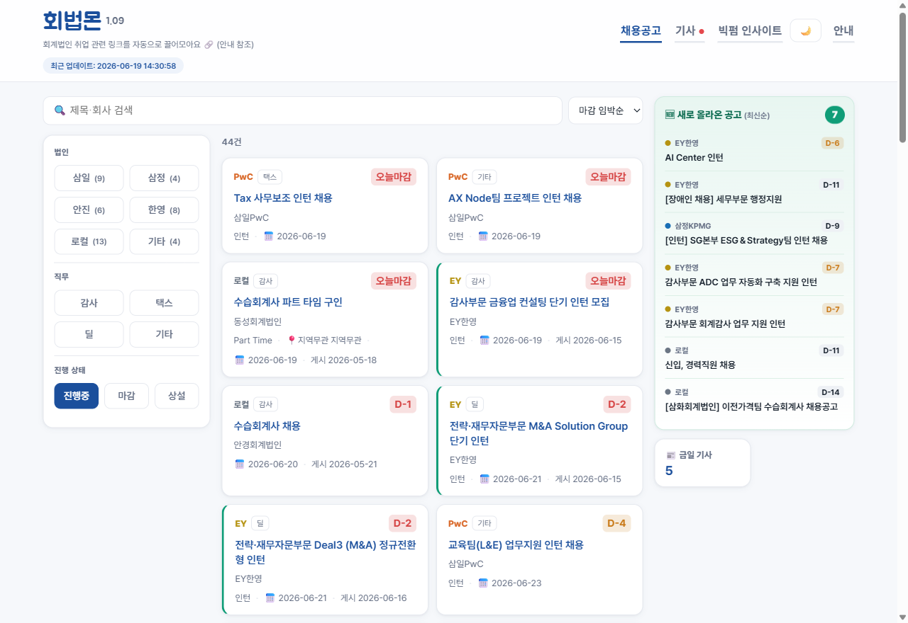
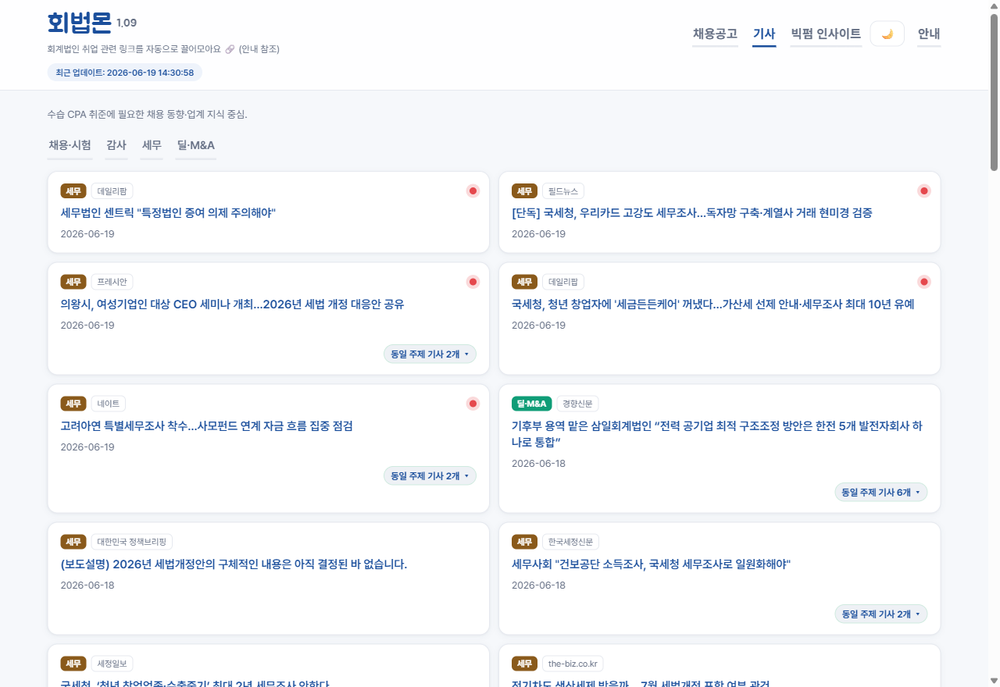

# 회법몬 (KICPA Career Hub)

[](https://hbmons.com)
[](https://github.com/jaehyuk-choi-KICPA/KICPA_CAREER_HUB_SITE/actions/workflows/tests.yml)


빅4와 로컬 회계법인의 수습공인회계사·입사 준비자를 위해, 흩어져 있는 채용공고와 회계·세무·딜 업계 뉴스, 빅펌 인사이트를 한 화면에 모아 보여주는 정적 웹 대시보드입니다. 라이브: **[hbmons.com](https://hbmons.com)**

수습 CPA를 준비하면 한국공인회계사회와 삼일·삼정·안진·한영 등 여러 사이트를 매번 따로 확인해야 합니다. 회법몬은 이 소스들을 자동으로 모아 법인·자격요건(수습CPA/자격무관)·채용구분(인턴/정규직/계약직/파트타임)·진행상태로 분류해 한 곳에 정리하고, 업계 뉴스와 빅펌 간행물 링크, 새 공고 브라우저 푸시 알림까지 함께 제공합니다. 서버나 노트북을 상시 켜둘 필요 없이, 외부 스케줄러가 GitHub Actions를 깨워 수집·커밋하면 GitHub Pages가 서빙합니다.

## 미리보기

| 채용공고 (법인·자격요건·채용구분·상태 필터, 푸시 알림) | 기사 (4분류, 같은 주제 묶기) |
|:---:|:---:|
| [](https://hbmons.com) | [](https://hbmons.com) |

## 설계에서 신경 쓴 것

회계 데이터를 다루다 보니 재현성과 검증가능성, 환각 차단을 우선했습니다.

- 어댑터 패턴. 사이트마다 다른 HTML·RSS·JSON을 하나의 공통 레코드로 수렴시켜, 이후 필터·분류·중복제거는 한 형태만 다룹니다. 새 소스를 붙일 때 어댑터 하나만 추가하면 됩니다.
- 규칙 기반 코어. 분류·필터·큐레이션은 전부 키워드 규칙(`config.yaml`)으로 두어 결정론적이고 재현 가능하며, 비용 없이 오프라인으로 동작합니다. 데이터 파이프라인에는 LLM을 넣지 않아 환각을 원천 차단했습니다.
- LLM은 판단에만, 그것도 제한적으로. 뉴스 의미 군집은 어휘로 애매한 경우에만 임베딩을 호출하고(키가 없으면 어휘 비교로 폴백), 시각 점검도 프로덕션 데이터를 쓰지 않는 별도 경로로 돌립니다.
- 사람이 확인하는 구조. 소스가 깨지면 감지와 진단은 자동으로 하되 코드 수정은 사람이 합니다. LLM은 제안만 하고 Draft PR로 올립니다.
- 한 소스가 깨져도 전체가 멈추지 않게. 모든 어댑터 호출을 `safe_fetch`로 감싸, 한 곳이 실패해도 나머지는 정상 출력됩니다.

## 운영하며 다듬은 신뢰성

실제로 24시간 도는 자동화라, 소스가 조용히 바뀌거나 스케줄이 빠지면 말없이 낡은 데이터가 나가는 문제를 여러 겹으로 감시합니다. 이 점검들은 통합 `monitor.yml`(5시간 주기)이 한 잡으로 묶어 돌리며, **신선도가 갱신되지 않은 경우에만 자동 재수집(셀프힐링)**하고 그 외 이상(렌더·코드·타당성)은 코드 자동수정 없이 GitHub 이슈로 올려 사람이 검토하게 합니다(Human-in-the-loop).

- monitor (통합·5h) — 아래 canary·sitecheck를 한 잡으로 묶어 점검. 신선도 미갱신만 자동 재수집, 코드/렌더 이상은 이슈. (freshness·sitecheck 개별 cron은 안정화까지 병행 후 폐기 예정.)
- freshness — 데이터 나이로 스케줄이 돌았는지 확인하고, 오래되면 Draft PR을 올립니다.
- canary — 소스별 수집 건수와 양식이 급변했는지 봅니다(0건·급감·양식변경).
- sitecheck — 배포된 화면을 브라우저로 열어 사용자가 제대로 보는지 종단 점검하고, 파생 지표의 타당성까지 봅니다.

실제로 겪은 사고도 있습니다. run-all 한 실행이 동시성 그룹 잠금을 쥔 채 멈춰 수집이 몇 시간 정지한 적이 있는데, 원인을 찾아 `timeout-minutes`를 걸어 멈춘 실행이 그룹을 오래 점유하지 못하도록 막았습니다. KICPA가 살아있는 공고를 목록에서 잠깐 내렸다 올리는 깜빡임은 state의 grace 레이어로 흡수해 카드가 사라지지 않게 했습니다.

## 콘텐츠

1. 채용공고 — KICPA(수습·CPA)와 삼정·안진·한영·삼일. 법인, 자격요건(수습CPA/자격무관), 채용구분(인턴/정규직/계약직/파트타임), 진행상태로 필터링하고 마감 D-day·새 공고 패널·**브라우저 푸시 알림**(전체/수습CPA 범위 선택)을 제공합니다.
2. 기사 — Google News RSS를 4개 카테고리(채용·시험/감사/세무/딜·M&A)로. 제목·출처·링크만 담고, 같은 사건의 중복 기사는 묶습니다.
3. 빅펌 인사이트 — 삼일·삼정·안진·한영 간행물 링크. SPA라 헤드리스 렌더로 가져오고, 저작권상 제목·링크만 답니다.

## 아키텍처

```
외부 스케줄러(cron-job.org) ──repository_dispatch──► GitHub Actions(run-all)
                                                          │
            6 어댑터(병렬) ─safe_fetch→ 공통 레코드 ─► 필터 ─► 규칙 분류 ─► (필요할 때만)임베딩 군집
                                                          │
                                          docs/data/*.json 커밋 ─► GitHub Pages(docs/) ─► 바닐라 SPA
                                                          │
                       모니터링: 통합 monitor(5h, canary+sitecheck) + freshness (이상 시 자동 재수집 / GitHub Issue)
            채용알림: 새 공고 → notifier(VAPID) → Cloudflare Worker 구독자에게 웹 푸시(전체/수습CPA)
```

## 기술 스택

Python(스크래퍼·규칙 엔진·상태기계), 바닐라 JS/CSS(프론트, 빌드 도구 없음, 다크모드·반응형), GitHub Actions(CI/CD·스케줄·셀프힐링), Playwright(SPA 렌더), GitHub Pages. 시각 점검과 의미 군집에는 Anthropic·Voyage API를 쓰되, 키가 없으면 자동으로 꺼져 결정론으로만 동작합니다.

## 테스트

순수 로직(필터, 분류, 상태기계, 날짜, 뉴스 중복제거)에 pytest 단위 테스트를 둡니다. 규칙이 곧 사양이라 실제 `config`로 검증합니다.

```bash
pip install pytest PyYAML
python -m pytest tests/ -v
```

## 로컬 실행

```bash
pip install -r requirements.txt
python -m playwright install chromium      # 인사이트(SPA 렌더)용 1회
python -m src.export                       # docs/data/{jobs,news,insights}.json 생성
#   부분만:  python -m src.export --part jobs|news|insights
cd docs && python -m http.server 8000      # http://localhost:8000
```

## 배포 (GitHub Pages)

1. `main`에 push한 뒤, Settings → Pages → Deploy from branch에서 `main` / `/docs` 선택.
2. 정기 수집은 외부 스케줄러(cron-job.org 등)가 `repository_dispatch{event_type:run-all}`로 `run-all.yml`을 30분마다 호출합니다. GitHub 무료·public cron은 드롭이 잦아 정기 수집은 외부 핑거가 맡고, 개별 `scrape*.yml`은 수동 보조로 둡니다. 모니터링은 통합 monitor(5시간, canary+sitecheck)와 freshness(매시간)가 GitHub cron을 씁니다(sitecheck는 monitor 안정화 후 폐기 예정). 새 공고는 notifier가 Cloudflare Worker 구독자에게 웹 푸시로 알립니다.
3. LLM 점검을 켜려면 Settings → Secrets → Actions에 `ANTHROPIC_API_KEY`를 추가합니다. 없으면 결정론 검사만 돕니다.

## 문서 (`docs-meta/`)

- [사용설명서](docs-meta/사용설명서.md) — 운영·배포·설정·문제해결
- [패치노트](docs-meta/PATCHNOTES.md) — 빌드별 UI 개선·새 기능
- [수집 엔진 개선 일지](docs-meta/SCRAPER_LOG.md) — 스크랩 툴 보완 흐름

## 원칙

공개된 채용공고와 공식 간행물의 제목·링크만 수집합니다(본문 전재나 개인정보 없음). 비영리입니다.

<sub>초기에는 카카오톡 오픈채팅 자동 게시로 시작했으나 GUI 자동화가 불안정해 웹 대시보드로 옮겼습니다. 레거시 코드는 보존돼 있습니다.</sub>
