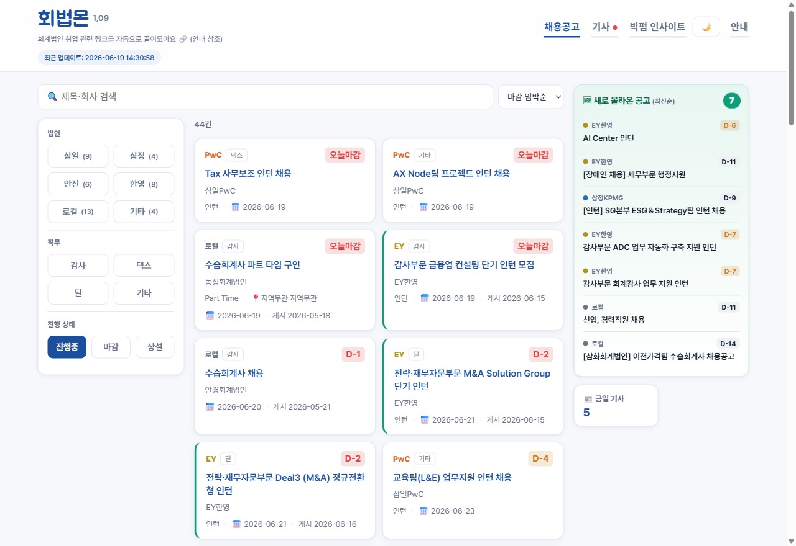
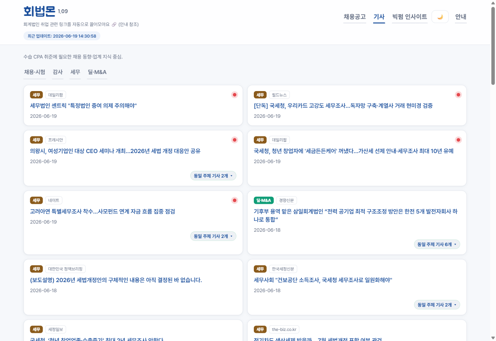

# 회법몬 (KICPA Career Hub)

[](https://hbmons.com)
[](https://github.com/jaehyuk-choi-KICPA/KICPA_CAREER_HUB_SITE/actions/workflows/tests.yml)


빅4와 로컬 회계법인의 수습공인회계사·입사 준비자를 위해, 흩어져 있는 채용공고와 감사·세무 업계 기사, 국내 산업 기사, 빅펌 리포트, 기업 감사정보를 한 화면에 모아 보여주는 정적 웹 대시보드입니다. 라이브: **[hbmons.com](https://hbmons.com)**

수습 CPA를 준비하면 한국공인회계사회와 삼일·삼정·안진·한영 등 여러 사이트를 매번 따로 확인해야 합니다. 회법몬은 이 소스들을 자동으로 모아 법인·자격요건(수습CPA/자격무관)·채용구분(인턴/정규직/계약직/파트타임)·진행상태로 분류해 한 곳에 정리하고, 업계·산업 기사와 빅펌 리포트, 기업별 감사인·감사의견·핵심감사사항, 새 공고 브라우저 푸시 알림까지 함께 제공합니다. 서버나 노트북을 상시 켜둘 필요 없이, 외부 스케줄러가 GitHub Actions를 깨워 수집·커밋하면 GitHub Pages가 서빙합니다.

## 미리보기

| 채용공고 (법인·자격요건·채용구분·상태 필터, 푸시 알림) | 기사·리포트 (업계·산업·리포트, 같은 사건 묶기) |
|:---:|:---:|
| [](https://hbmons.com) | [](https://hbmons.com) |

## 설계에서 신경 쓴 것

회계 데이터를 다루다 보니 재현성과 검증가능성, 환각 차단을 우선했습니다.

- 어댑터 패턴. 사이트마다 다른 HTML·RSS·JSON을 하나의 공통 레코드로 수렴시켜, 이후 필터·분류·중복제거는 한 형태만 다룹니다. 새 소스를 붙일 때 어댑터 하나만 추가하면 됩니다.
- 규칙 기반 코어. 분류·필터·큐레이션은 전부 키워드 규칙(`src/config.py`의 기본값 + `config.yaml` 오버라이드)으로 두어 결정론적이고 재현 가능하며, 비용 없이 오프라인으로 동작합니다. 데이터 파이프라인에는 LLM을 넣지 않아 환각을 원천 차단했습니다.
- LLM은 판단에만, 그것도 제한적으로. 뉴스 의미 군집은 어휘로 애매한 경우에만 임베딩을 호출하고(키가 없으면 어휘 비교로 폴백), 시각 점검도 프로덕션 데이터를 쓰지 않는 별도 경로로 돌립니다.
- 사람이 확인하는 구조. 소스가 깨지면 감지와 진단은 자동으로 하되 코드 수정은 사람이 합니다. LLM은 제안만 하고 Draft PR로 올립니다.
- 한 소스가 깨져도 전체가 멈추지 않게. 모든 어댑터 호출을 `safe_fetch`로 감싸, 한 곳이 실패해도 나머지는 정상 출력됩니다.

## 운영하며 다듬은 신뢰성

실제로 24시간 도는 자동화라, 소스가 조용히 바뀌거나 스케줄이 빠지면 말없이 낡은 데이터가 나가는 문제를 여러 겹으로 감시합니다. 이 점검들은 통합 `monitor.yml`(1일 1회, KST 07:00)이 한 잡으로 묶어 돌리며, **신선도가 갱신되지 않은 경우에만 자동 재수집(셀프힐링)**하고 그 외 이상(렌더·코드·타당성)은 코드 자동수정 없이 GitHub 이슈로 올려 사람이 검토하게 합니다(Human-in-the-loop).

- monitor (통합·1일 1회) — 아래 canary·sitecheck를 한 잡으로 묶어 점검. 신선도 미갱신만 자동 재수집, 코드/렌더 이상은 이슈. (sitecheck 개별 cron은 중복 비전 호출을 없애려 폐기하고 수동 전용으로 두었습니다.)
- freshness (매시간) — 데이터 나이로 스케줄이 돌았는지 확인하고, 오래되면 Draft PR을 올립니다. LLM을 쓰지 않아 무료라 촘촘히 돌립니다.
- canary — 소스별 수집 건수와 양식이 급변했는지 봅니다(0건·급감·양식변경).
- sitecheck — 배포된 화면을 브라우저로 열어 사용자가 제대로 보는지 종단 점검하고, 파생 지표의 타당성까지 봅니다.

실제로 겪은 사고도 있습니다. run-all 한 실행이 동시성 그룹 잠금을 쥔 채 멈춰 수집이 몇 시간 정지한 적이 있는데, 원인을 찾아 `timeout-minutes`를 걸어 멈춘 실행이 그룹을 오래 점유하지 못하도록 막았습니다. KICPA가 살아있는 공고를 목록에서 잠깐 내렸다 올리는 깜빡임은 state의 grace 레이어로 흡수해 카드가 사라지지 않게 했습니다. 수집 시각을 스트림 다섯이 한 파일에 나눠 쓰다 보니 워크플로가 서로의 시각을 되돌리는 일도 있었는데, 수집 직전에 원격 상태를 먼저 받아오도록 규약을 고정해 막았습니다.

## 콘텐츠

1. 채용공고 — KICPA(수습·CPA)와 삼정·안진·한영·삼일, 어댑터 6개. 법인, 자격요건(수습CPA/자격무관), 채용구분(인턴/정규직/계약직/파트타임), 진행상태로 필터링하고 마감 D-day·새 공고 패널·2026 신규공채 큐레이션·**브라우저 푸시 알림**(전체/수습CPA/빅4인턴 범위 선택)을 제공합니다.
2. 업계 기사 — Google News RSS를 채용·시험 / 감사 / 세무 세 갈래로. 제목·출처·링크만 담고, 같은 사건의 중복 기사는 묶습니다.
3. 산업 기사 — 반도체·자동차·조선·건설 등 국내 산업 11개를 **회계·재무 렌즈**(실적·수주·증설·증자·인수·손상·구조조정)로 모읍니다. 기업 사전 215곳으로 기사에 기업 태그를 붙여 `산업군 → 기업 → 전자공시` 동선을 만듭니다. 업계 기사와는 필터·군집·보존 기준이 달라 파이프라인을 아예 분리했습니다.
4. 빅펌 리포트 — 삼일·삼정·안진·한영 간행물 링크. SPA라 헤드리스 렌더로 가져오고, 저작권상 제목·링크만 답니다.
5. 기업 감사정보 — 금융감독원 DART **Open API**로 기업별 감사인·감사의견·핵심감사사항(KAM)·강조사항을 모읍니다. 스크래핑이 아니라 공식 API라 안정적이고, 수치와 링크만 저장합니다. 재무 수치는 담지 않고 전자공시 원문으로 넘깁니다.

여기에 두 가지를 덧붙였습니다. 위 스트림은 매 수집마다 전량 덮어쓰기라 보존 기간이 지나면 기사가 사라지므로, **누적 아카이브**를 월별 샤드로 따로 append해 화면의 '전체 기간' 필터로 2026년 5월치까지 거슬러 볼 수 있게 했습니다. 그리고 자소서 글자수·바이트(한글 2byte/3byte 토글)를 세는 프론트 전용 유틸을 두었는데, 입력은 브라우저 밖으로 나가지 않습니다.

## 아키텍처

```
외부 스케줄러(cron-job.org) ──repository_dispatch──► GitHub Actions (run-all, 30분)
                                                             │
   어댑터 40개  채용 6 · 업계 4 · 산업 26 · 리포트 4          │
        └─ safe_fetch ─► 공통 레코드 ─► 필터 ─► 규칙 분류 ─► (애매할 때만) 임베딩 군집
   DART Open API ────► 기업 감사인 · 감사의견 · 핵심감사사항
                                                             ▼
                                    docs/data/*.json  +  archive/{스트림}/{YYYY-MM}.json
                                                             │
                                      git commit ─► GitHub Pages(docs/) ─► 바닐라 SPA
                                                             │
        ├─ 모니터링   monitor(1일 1회, canary+sitecheck) · freshness(1h) → 자동 재수집 / GitHub Issue
        └─ 채용알림   새 공고 ─► notifier(VAPID) ─► Cloudflare Worker 구독자 웹 푸시
```

## 기술 스택

Python(스크래퍼·규칙 엔진·상태기계), 바닐라 JS/CSS(프론트, 빌드 도구 없음, 다크모드·반응형), GitHub Actions(CI/CD·스케줄·셀프힐링), Playwright(SPA 렌더), GitHub Pages. 시각 점검과 의미 군집에는 Anthropic·Voyage API를, 기업 감사정보에는 금융감독원 DART Open API를 쓰되, 키가 없으면 해당 기능만 자동으로 꺼지고 나머지는 결정론으로 그대로 동작합니다.

## 테스트

순수 로직(필터, 분류, 상태기계, 날짜, 기사 중복제거, 기업 태깅, 아카이브 병합)에 pytest 단위 테스트 115건을 둡니다. 규칙이 곧 사양이라 실제 `config`로 검증합니다. 기업 태깅처럼 오탐이 조용히 새는 곳은 실제로 겪은 사례(`기아대책본부`·`현대차증권`·`KTX`)를 고정 테스트로 박아 두었습니다.

```bash
pip install pytest PyYAML
python -m pytest tests/ -v
```

## 로컬 실행

```bash
pip install -r requirements.txt
python -m playwright install chromium      # 인사이트(SPA 렌더)용 1회
python -m src.export                       # docs/data/*.json 생성
#   부분만:  python -m src.export --part jobs|news|insights|industry|companies
cd docs && python -m http.server 8000      # http://localhost:8000
```

## 배포 (GitHub Pages)

1. `main`에 push한 뒤, Settings → Pages → Deploy from branch에서 `main` / `/docs` 선택.
2. 정기 수집은 외부 스케줄러(cron-job.org 등)가 `repository_dispatch{event_type:run-all}`로 `run-all.yml`을 30분마다 호출합니다. GitHub 무료·public cron은 드롭이 잦아 정기 수집은 외부 핑거가 맡고, 개별 `scrape*.yml`은 수동 보조로 둡니다. 모니터링은 통합 monitor(1일 1회)와 freshness(매시간)가 GitHub cron을 씁니다. 새 공고는 notifier가 Cloudflare Worker 구독자에게 웹 푸시로 알립니다.
3. 선택 기능은 Settings → Secrets → Actions의 키로 켭니다. 없으면 그 기능만 꺼지고 사이트는 정상 동작합니다.
   - `ANTHROPIC_API_KEY` — 카나리아 시각 점검. 없으면 결정론 검사만.
   - `VOYAGE_API_KEY` — 기사 의미 군집. 없으면 어휘 군집으로 폴백.
   - `DART_API_KEY` — 기업 감사정보. 없으면 전자공시 검색 링크만 노출.
   - `VAPID_PRIVATE_KEY`·`SUBS_READ_TOKEN` — 채용 푸시 알림 발송.

## 문서 (`docs-meta/`)

- [워크플로우](docs-meta/WORKFLOW.md) — 전체 파이프라인·데이터 흐름·파일 맵
- [사용설명서](docs-meta/사용설명서.md) — 운영·배포·설정·문제해결
- [패치노트](docs-meta/PATCHNOTES.md) — 빌드별 UI 개선·새 기능
- [수집 엔진 개선 일지](docs-meta/SCRAPER_LOG.md) — 스크랩 툴 보완 흐름

## 원칙

공개된 채용공고와 공식 간행물의 제목·링크만 수집합니다(본문 전재나 개인정보 없음). 비영리입니다.

<sub>초기에는 카카오톡 오픈채팅 자동 게시로 시작했으나 GUI 자동화가 불안정해 웹 대시보드로 옮겼습니다. 레거시 코드는 보존돼 있습니다.</sub>
