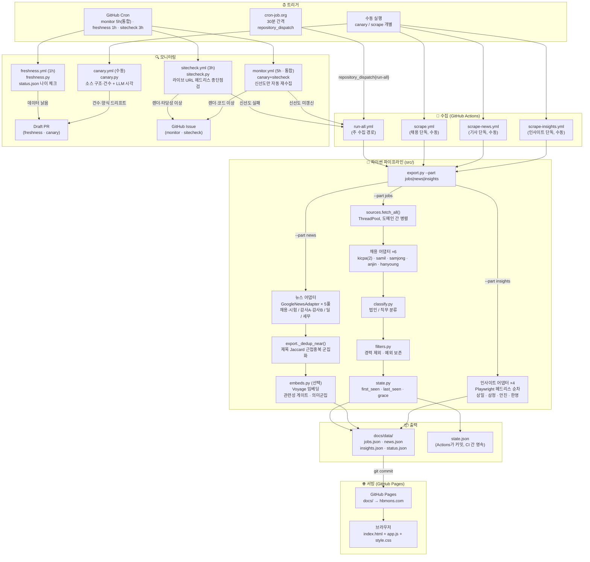
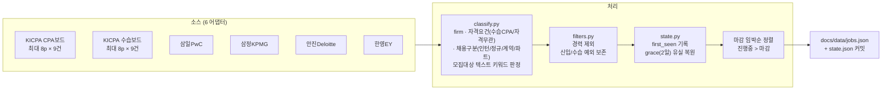
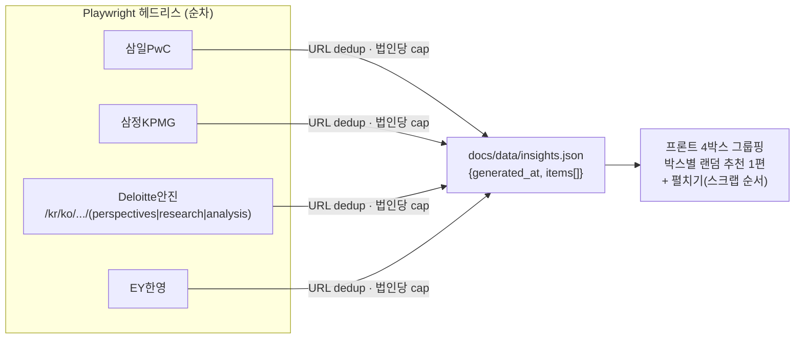
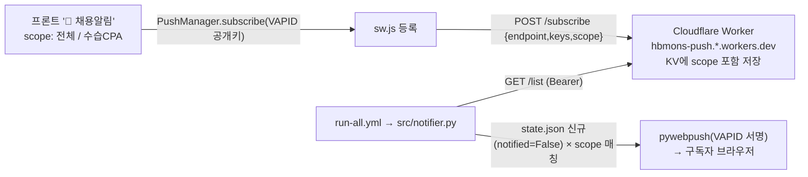

# 회법몬(hbmons.com) 전체 워크플로우

> **연동 규칙**: 아래 파일이 변경되면 이 문서도 함께 수정한다.
> `.github/workflows/*.yml` · `src/export.py` · `src/sources.py` · `src/adapters/*` · `src/config.py`

---

## 1. 전체 흐름 (조감도)



> **추가 흐름**: `run-all`은 수집 후 **푸시 발송**(`src/notifier.py` → 구독자)도 수행한다(§5.5 채용알림). 모니터링은 **통합 `monitor.yml`(5h)**이 canary+sitecheck를 묶어 점검하며 신선도 미갱신만 자동 재수집한다(§5).

---

## 2. 채용공고 파이프라인 상세



**핵심 필드**: `firm` · `qualification`(수습CPA/자격무관) · `emp_kind`(인턴/정규직/계약직/파트타임) · `status(open/closed)` · `dday` · `posted_date` · `first_seen` · `is_new`(발견 24h)
*(구 `field`(직무)는 폐기 — export에서 레거시 병행만)*

**KICPA 상세 보강(`kicpa.py._enrich_deadline`)**: KICPA 목록엔 마감일·모집대상이 없어 상세페이지를 1회 방문해 **마감일·근무지·고용형태 + 모집대상/자격요건 본문(`div.txt_infor`→`body_excerpt`)**을 채운다. 덕분에 `filters.passes`·`classify_qualification`이 **제목 너머 모집대상까지** 보고 판정(경력/신입 오분류 방지). 마감일·본문 모두 `native_id` 캐시(`state` 영속)로 **1회만 수집·재사용**. *(bypass: `kicpa_susup` 보드는 경력 필터 면제 — 보드 자체가 수습CPA 타깃.)*

---

## 3. 뉴스 파이프라인 상세

```mermaid
flowchart LR
    subgraph RSS["Google News RSS (5풀)"]
        N1["채용·시험 쿼리<br/>75건"]
        N2["감사 풀A (기준·제도)<br/>75건"]
        N3["감사 풀B (보수·처분)<br/>75건"]
        N4["딜·M&A 쿼리<br/>75건"]
        N5["세무 쿼리<br/>75건"]
    end

    subgraph FILTER2["필터"]
        RD["recency 필터<br/>카테고리별 보존기간<br/>채용75·딜30·세무21·감사21일"]
        FF["외국 기사 필터<br/>세무·감사만 적용<br/>news_foreign_sources/countries"]
        RA["require_any 게이트<br/>도메인어 없으면 제외"]
        GT["노이즈 게이트<br/>보도자료·지자체 행정·코인·Naver Blog"]
        HT["hire_title 보정<br/>채용 키워드 제목→채용·시험 재분류"]
    end

    subgraph DEDUP2["중복 처리"]
        URL["URL dedup (동일 기사)"]
        NEAR["_dedup_near()<br/>Jaccard 근접중복 군집화<br/>대표 1건 + dupes 첨부"]
        EMB["embeds.refine() (선택)<br/>의미 유사 군집 보조"]
    end

    CAP["news_max_per_day_per_cat<br/>카테고리×일자 상한"]
    SORT2["published_at 내림차순 정렬<br/>시각 tiebreaker"]
    OUT2["docs/data/news.json"]

    RSS --> URL --> RD --> FF --> RA --> GT --> HT --> SORT2 --> NEAR --> EMB --> CAP --> OUT2
```



**풀 분리 이유**: Google RSS는 관련도순 100건 상한 → 단일 감사 쿼리는 오늘 기사가 100위 밖으로 밀림 → 2풀로 각 100건 확보.
**딜 편중 보정**: 딜 보존 60→30일 축소 + 프론트 `spreadCategories`(전체 탭, 같은 카테고리 3연속 방지)로 dedup 압축 비대칭(감사/세무는 1건으로 묶이고 딜은 개별 건이라 다수)에 따른 딜 도배 완화.

---

## 4. 인사이트 파이프라인 상세



**순차 이유**: Playwright sync API는 스레드 비안전.

---

## 5. 모니터링 (통합 monitor.yml 5h + 레거시 3층 병행)

**통합**: `monitor.yml`(5h cron `0 */5 * * *`)이 canary(소스 급감 구조점검) + sitecheck(라이브 종단·신선도 셀프힐링)를
**한 잡**으로 묶어 점검한다. **신선도 미갱신(recoverable)일 때만 자동 재수집**, 그 외(렌더·타당성·코드)는 `monitor`/`needs-human`
라벨 GitHub 이슈로 에스컬레이션. 안정 확인 전까지 아래 레거시 3층도 병행하며, 이후 freshness·sitecheck의 cron을 폐기(수동 전용)해 중복 제거 예정.

| 층 | 파일 | 주기 | 감지 대상 | 출력 |
|---|---|---|---|---|
| **통합** | **`monitor.yml`** (canary+sitecheck) | **5h** | 소스 급감 + 라이브 종단·신선도 | 이슈 / 신선도시 자동 재수집 |
| 실행됐나 | `freshness.py` | 1h | `status.json` 나이 > 임계 (외부핑거 죽음) | Draft PR |
| 수집됐나 | `canary.py` | 수동 | 소스별 건수 급감·0건·양식 변경 | Draft PR + LLM 진단 |
| 제대로 보이나 | `sitecheck.py` | 3h | 라이브 URL 렌더·카드수·콘솔 에러·타당성 | GitHub Issue |

**셀프힐링**: monitor/sitecheck가 `recoverable`(신선도 미갱신) 판정 시 scrape 재실행 → 재점검 (최대 attempts 상한).  
**Human-in-the-loop**: LLM은 진단·제안만, 코드 수정·머지는 사람이 Claude Code로.

---

## 5.5 채용알림 (웹 푸시) 파이프라인



- **scope**: `수습CPA 전용` 구독자는 `classify_qualification`이 수습CPA인 공고만, `전체`는 인턴·일반 포함 전부 수신.
- **콜드스타트 억제**: 활성화 직전 `python -m src.notifier --seed`로 기존 공고를 baseline(notified=True) 처리 → 가입 직후 폭주 없음.
- **보안**: VAPID 개인키(`VAPID_PRIVATE_KEY`)·구독 read 토큰(`SUBS_READ_TOKEN`)은 **GitHub Secret에서만**. Worker `READ_TOKEN`은 `wrangler secret`. 코드/커밋엔 **공개키만**.
- **구성요소**: `docs/sw.js`(수신) · `docs/app.js subscribePush()`(구독) · `worker/subscriptions.js`(KV 저장) · `src/notifier.py`(발송) · `config.notifications`(enabled·worker_url·vapid_public). 견고성: 발송 실패가 run을 막지 않음(`|| true`), 미발송분은 notified=False로 남아 다음 run 재시도.
- **시험 발송(수동)**: `push-test.yml`(workflow_dispatch) → `scripts/push_test.py`가 구독자 전원에게 '시험 알림' 1건 발송. **state 미변경(멱등)**. VAPID 개인키가 GitHub Secret에만 있어 로컬 발송이 불가하므로, 푸시 동작 점검은 Actions에서 이 워크플로를 돌려 확인한다(입력 `body`·`url` 커스텀; `url` 비우면 `jobs.json` 첫 공고로 보내 **알림→공고→뒤로가기=홈** 동선까지 실기기 점검 가능).
- **알림 클릭 동선(뒤로가기/닫기=회법몬)**: `sw.js notificationclick`이 외부 공고를 **회법몬 홈(`/?goto=<공고URL>`) 경유**로 연다. `index.html` 인라인이 **홈을 먼저 렌더(load 후 ~450ms 노출)한 뒤** `replaceState('/')`+`pushState('/')`+`location.replace(공고)`로 히스토리를 **[홈, 공고]**로 구성 → 공고에서 '뒤로 가기'(또는 모바일 닫기) 시 (빈 화면이 아닌) 회법몬이 뜬다. **'홈 먼저 렌더'가 핵심**: 즉시 튕기면(미렌더) iOS에서 닫을 때 빈 화면이 됐음. http(s)만 허용·재리다이렉트 방지. Playwright로 데스크톱 검증(홈→공고→뒤로=홈). **iOS 분기**: `location.replace`는 홈 문서를 파괴해 X로 닫을 때 빈 화면이 되므로 iOS만 `location.assign`으로 보내 렌더된 홈을 bfcache로 남긴다(X/뒤로 시 복원).

---

## 6. 파일 맵

```
회법몬/
├── CLAUDE.md                    ← 프로젝트 컨텍스트 (Claude Code 자동 로드)
├── config.yaml                  ← 운영 설정 (runtime · filters · formats)
├── src/
│   ├── config.py                ← dashboard 전체 규칙 (쿼리·필터·분류)
│   ├── export.py                ← 수집 진입점 (--part jobs|news|insights)
│   ├── sources.py               ← ThreadPool 병렬 fetch 조율
│   ├── state.py                 ← 채용공고 상태 영속 (first_seen · grace)
│   ├── classify.py              ← 법인/자격요건(수습CPA·자격무관)/채용구분(인턴·정규·계약·파트) 분류
│   ├── filters.py               ← 경력 제외 필터
│   ├── notifier.py              ← 웹 푸시 채용알림 발송(pywebpush·VAPID·scope)
│   ├── news.py                  ← NewsItem 데이터클래스
│   ├── record.py                ← Posting 데이터클래스
│   ├── embeds.py                ← Voyage 임베딩 (키 있을 때만)
│   ├── render.py                ← Playwright 헤드리스 유틸
│   ├── canary.py                ← 수집 구조 감시
│   ├── freshness.py             ← 실행 신선도 감시
│   ├── sitecheck.py             ← 라이브 종단 점검
│   ├── http_util.py             ← safe HTTP (재시도·인코딩)
│   ├── util.py                  ← 공통 유틸
│   └── adapters/
│       ├── base.py              ← Adapter ABC + safe_fetch
│       ├── kicpa.py             ← KICPA CPA/수습 보드
│       ├── samil.py             ← 삼일PwC
│       ├── samjong.py           ← 삼정KPMG
│       ├── anjin.py             ← 안진Deloitte
│       ├── hanyoung.py          ← 한영EY
│       ├── news_rss.py          ← Google News RSS (5풀)
│       └── insights.py          ← Big4 간행물 (Playwright)
├── docs/                        ← GitHub Pages 루트 (hbmons.com)
│   ├── index.html               ← SPA 껍데기
│   ├── app.js                   ← 전체 프론트 로직 (필터 2축·카드·푸시 구독)
│   ├── style.css                ← 스타일
│   ├── sw.js                    ← 푸시 서비스워커 (수신, 캐시 없음)
│   ├── manifest.json            ← PWA 매니페스트 (아이콘·테마색)
│   ├── icon.svg / icon-192·512.png / favicon.ico / apple-touch-icon.png  ← 로고/아이콘
│   └── data/
│       ├── jobs.json            ← 채용공고 (qualification·emp_kind 포함)
│       ├── news.json            ← 기사 (Actions가 갱신)
│       ├── insights.json        ← 인사이트 (Actions가 갱신)
│       ├── status.json          ← 마지막 수집 시각
│       └── notify_status.json   ← 푸시 발송 관측성
├── .github/workflows/
│   ├── run-all.yml              ← 주 수집 (외부핑거 → repository_dispatch) + 푸시 발송(notifier)
│   ├── push-test.yml            ← 수동 시험 푸시 (scripts/push_test.py · state 미변경)
│   ├── monitor.yml              ← 통합 점검 (5h cron · canary+sitecheck 셀프힐링)
│   ├── freshness.yml            ← 신선도 감시 (1h cron · monitor 안정화 후 폐기 예정)
│   ├── sitecheck.yml            ← 종단 점검 (3h cron · monitor 안정화 후 폐기 예정)
│   ├── canary.yml               ← 양식 감시 (수동)
│   ├── scrape.yml               ← 채용 단독 (수동) <-외부 핑거로 가동
│   ├── scrape-news.yml          ← 기사 단독 (수동) <-외부 핑거로 가동
│   └── scrape-insights.yml      ← 인사이트 단독 (수동) <-외부 핑거로 가동
├── worker/                      ← Cloudflare Worker (푸시 구독 저장소, 정적 사이트의 미니 백엔드)
│   ├── subscriptions.js         ← /subscribe·/list·/unsubscribe (KV, scope 저장)
│   └── wrangler.toml            ← 배포 설정 (KV 바인딩·ALLOWED_ORIGIN)
├── docs-meta/                   ← 개발 문서 (GitHub Pages 미서빙)
│   ├── WORKFLOW.md              ← ★ 이 파일 (워크플로우 시각화)
│   ├── PATCHNOTES.md            ← UI/기능 빌드 이력
│   ├── SCRAPER_LOG.md           ← 수집툴 변경 이력
│   └── 사용설명서.md             ← 운영·배포 가이드
├── state.json                   ← 채용공고 상태 (Actions 커밋으로 CI 간 영속)
├── canary_state.json            ← 소스별 건수 이력 (canary 기준선)
└── tests/                       ← pytest 단위 테스트
```

---

## 7. 외부 핑거 설정 요약

| 항목 | 값 |
|---|---|
| 서비스 | cron-job.org |
| 주기 | 30분 |
| Method | POST |
| URL | `https://api.github.com/repos/jaehyuk-choi-KICPA/KICPA_CAREER_HUB_SITE/dispatches` |
| Headers | `Authorization: Bearer <PAT>` · `Accept: application/vnd.github+json` · `X-GitHub-Api-Version: 2022-11-28` |
| Body | `{"event_type":"run-all"}` |
| PAT 권한 | Contents R/W · Actions R/W |
