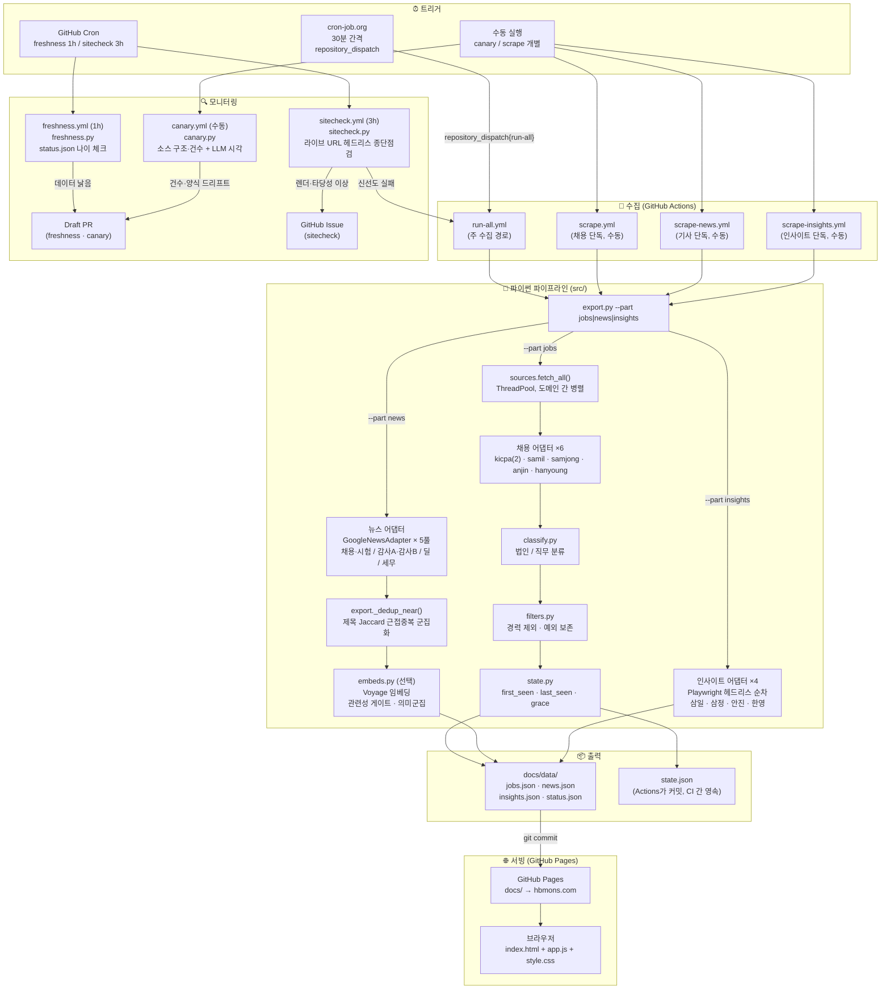
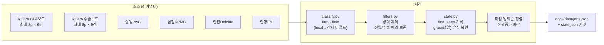
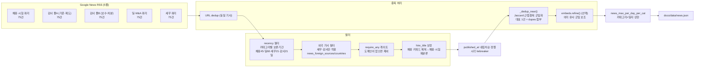
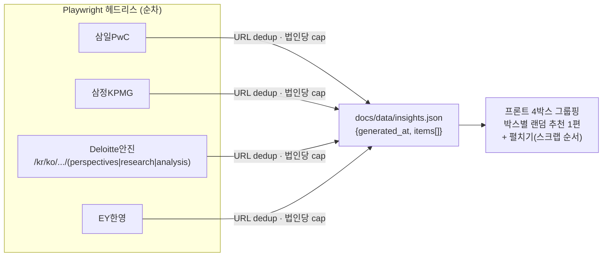

# 회법몬(hbmons.com) 전체 워크플로우

> **연동 규칙**: 아래 파일이 변경되면 이 문서도 함께 수정한다.
> `.github/workflows/*.yml` · `src/export.py` · `src/sources.py` · `src/adapters/*` · `src/config.py`

---

## 1. 전체 흐름 (조감도)



---

## 2. 채용공고 파이프라인 상세



**핵심 필드**: `firm` · `field` · `status(open/closed)` · `dday` · `posted_date` · `first_seen` · `is_new`

---

## 3. 뉴스 파이프라인 상세



**풀 분리 이유**: Google RSS는 관련도순 100건 상한 → 단일 감사 쿼리는 오늘 기사가 100위 밖으로 밀림 → 2풀로 각 100건 확보.

---

## 4. 인사이트 파이프라인 상세



**순차 이유**: Playwright sync API는 스레드 비안전.

---

## 5. 모니터링 3층

| 층 | 파일 | 주기 | 감지 대상 | 출력 |
|---|---|---|---|---|
| 실행됐나 | `freshness.py` | 1h | `status.json` 나이 > 임계 (외부핑거 죽음) | Draft PR |
| 수집됐나 | `canary.py` | 수동 | 소스별 건수 급감·0건·양식 변경 | Draft PR + LLM 진단 |
| 제대로 보이나 | `sitecheck.py` | 3h | 라이브 URL 렌더·카드수·콘솔 에러·타당성 | GitHub Issue |

**셀프힐링**: sitecheck가 `recoverable` 판정 시 scrape 재실행 → 재점검 (최대 attempts 상한).  
**Human-in-the-loop**: LLM은 진단·제안만, 코드 수정·머지는 사람이 Claude Code로.

---

## 6. 파일 맵

```
회법몬/
├── CLAUDE.md                    ← 프로젝트 컨텍스트 (Claude Code 자동 로드)
├── config.yaml                  ← 운영 설정 (runtime · filters · formats)
├── src/
│   ├── config.py                ← dashboard 전체 규칙 (쿼리·필터·분류)
│   ├── export.py                ← 수집 진입점 (--part jobs|news|insights)
│   ├── sources.py               ← ThreadPool 병렬 fetch 조율
│   ├── state.py                 ← 채용공고 상태 영속 (first_seen · grace)
│   ├── classify.py              ← 법인/직무 분류 규칙
│   ├── filters.py               ← 경력 제외 필터
│   ├── news.py                  ← NewsItem 데이터클래스
│   ├── record.py                ← Posting 데이터클래스
│   ├── embeds.py                ← Voyage 임베딩 (키 있을 때만)
│   ├── render.py                ← Playwright 헤드리스 유틸
│   ├── canary.py                ← 수집 구조 감시
│   ├── freshness.py             ← 실행 신선도 감시
│   ├── sitecheck.py             ← 라이브 종단 점검
│   ├── http_util.py             ← safe HTTP (재시도·인코딩)
│   ├── util.py                  ← 공통 유틸
│   └── adapters/
│       ├── base.py              ← Adapter ABC + safe_fetch
│       ├── kicpa.py             ← KICPA CPA/수습 보드
│       ├── samil.py             ← 삼일PwC
│       ├── samjong.py           ← 삼정KPMG
│       ├── anjin.py             ← 안진Deloitte
│       ├── hanyoung.py          ← 한영EY
│       ├── news_rss.py          ← Google News RSS (5풀)
│       └── insights.py          ← Big4 간행물 (Playwright)
├── docs/                        ← GitHub Pages 루트 (hbmons.com)
│   ├── index.html               ← SPA 껍데기
│   ├── app.js                   ← 전체 프론트 로직
│   ├── style.css                ← 스타일
│   └── data/
│       ├── jobs.json            ← 채용공고 (Actions가 갱신)
│       ├── news.json            ← 기사 (Actions가 갱신)
│       ├── insights.json        ← 인사이트 (Actions가 갱신)
│       └── status.json          ← 마지막 수집 시각
├── .github/workflows/
│   ├── run-all.yml              ← 주 수집 (외부핑거 → repository_dispatch)
│   ├── freshness.yml            ← 신선도 감시 (1h cron)
│   ├── sitecheck.yml            ← 종단 점검 (3h cron)
│   ├── canary.yml               ← 양식 감시 (수동)
│   ├── scrape.yml               ← 채용 단독 (수동)
│   ├── scrape-news.yml          ← 기사 단독 (수동)
│   └── scrape-insights.yml      ← 인사이트 단독 (수동)
├── docs-meta/                   ← 개발 문서 (GitHub Pages 미서빙)
│   ├── WORKFLOW.md              ← ★ 이 파일 (워크플로우 시각화)
│   ├── PATCHNOTES.md            ← UI/기능 빌드 이력
│   ├── SCRAPER_LOG.md           ← 수집툴 변경 이력
│   └── 사용설명서.md             ← 운영·배포 가이드
├── state.json                   ← 채용공고 상태 (Actions 커밋으로 CI 간 영속)
├── canary_state.json            ← 소스별 건수 이력 (canary 기준선)
└── tests/                       ← pytest 단위 테스트
```

---

## 7. 외부 핑거 설정 요약

| 항목 | 값 |
|---|---|
| 서비스 | cron-job.org |
| 주기 | 30분 |
| Method | POST |
| URL | `https://api.github.com/repos/jaehyuk-choi-KICPA/KICPA_CAREER_HUB_SITE/dispatches` |
| Headers | `Authorization: Bearer <PAT>` · `Accept: application/vnd.github+json` · `X-GitHub-Api-Version: 2022-11-28` |
| Body | `{"event_type":"run-all"}` |
| PAT 권한 | Contents R/W · Actions R/W |
