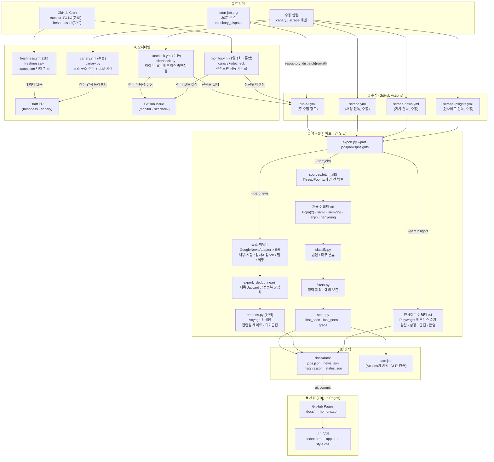
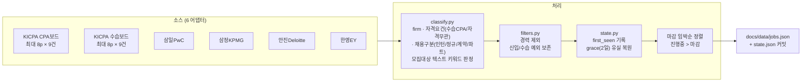
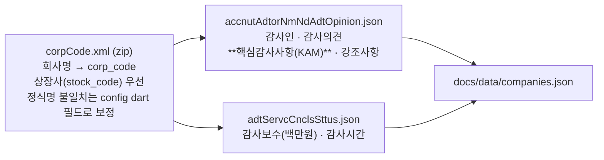
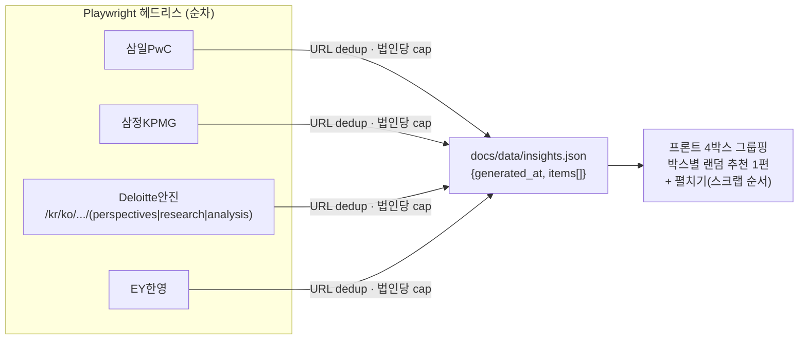
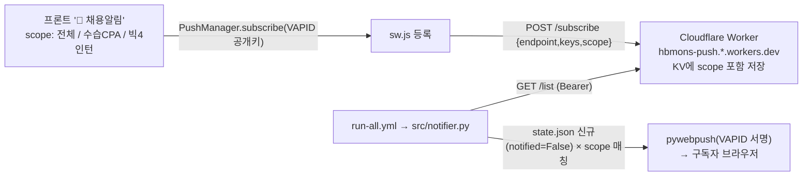

# 회법몬(hbmons.com) 전체 워크플로우

> **연동 규칙**: 아래 파일이 변경되면 이 문서도 함께 수정한다.
> `.github/workflows/*.yml` · `src/export.py` · `src/sources.py` · `src/adapters/*` · `src/config.py`

---

## 1. 전체 흐름 (조감도)


```mermaid
flowchart TD
    subgraph TRIGGER["⏰ 트리거"]
        EXT["cron-job.org<br/>30분 간격<br/>repository_dispatch"]
        GH_CRON["GitHub Cron<br/>monitor 1일1회(통합) · freshness 1h(무료)"]
        MANUAL["수동 실행<br/>canary / scrape 개별"]
    end

    subgraph COLLECT["🔄 수집 (GitHub Actions)"]
        RUN_ALL["run-all.yml<br/>(주 수집 경로)"]
        SCRAPE["scrape.yml<br/>(채용 단독, 수동)"]
        SCRAPE_N["scrape-news.yml<br/>(기사 단독, 수동)"]
        SCRAPE_I["scrape-insights.yml<br/>(인사이트 단독, 수동)"]
    end

    subgraph PIPELINE["🐍 파이썬 파이프라인 (src/)"]
        EXPORT["export.py --part jobs|news|insights"]
        SOURCES["sources.fetch_all()<br/>ThreadPool, 도메인 간 병렬"]
        ADAPTERS_J["채용 어댑터 ×6<br/>kicpa(2) · samil · samjong · anjin · hanyoung"]
        ADAPTERS_N["뉴스 어댑터<br/>GoogleNewsAdapter × 5풀<br/>채용·시험 / 감사A·감사B / 딜 / 세무"]
        ADAPTERS_I["인사이트 어댑터 ×4<br/>Playwright 헤드리스 순차<br/>삼일 · 삼정 · 안진 · 한영"]
        STATE["state.py<br/>first_seen · last_seen · grace"]
        CLASSIFY["classify.py<br/>법인 / 직무 분류"]
        FILTER["filters.py<br/>경력 제외 · 예외 보존"]
        DEDUP["export._dedup_near()<br/>제목 Jaccard 근접중복 군집화"]
        EMBEDS["embeds.py (선택)<br/>Voyage 임베딩<br/>관련성 게이트 · 의미군집"]
    end

    subgraph OUTPUT["📦 출력"]
        DATA["docs/data/<br/>jobs.json · news.json<br/>insights.json · status.json"]
        STATE_J["state.json<br/>(Actions가 커밋, CI 간 영속)"]
    end

    subgraph SERVE["🌐 서빙 (GitHub Pages)"]
        PAGES["GitHub Pages<br/>docs/ → hbmons.com"]
        BROWSER["브라우저<br/>index.html + app.js + style.css"]
    end

    subgraph MONITOR["🔍 모니터링"]
        FRESH["freshness.yml (1h)<br/>freshness.py<br/>status.json 나이 체크"]
        SITE["sitecheck.yml (수동)<br/>sitecheck.py<br/>라이브 URL 헤드리스 종단점검"]
        CANARY["canary.yml (수동)<br/>canary.py<br/>소스 구조·건수 + LLM 시각"]
        MON["monitor.yml (1일 1회 · 통합)<br/>canary+sitecheck<br/>신선도만 자동 재수집"]
        DRAFT_PR["Draft PR<br/>(freshness · canary)"]
        GH_ISSUE["GitHub Issue<br/>(monitor · sitecheck)"]
    end

    EXT -->|"repository_dispatch{run-all}"| RUN_ALL
    GH_CRON --> MON & FRESH
    MANUAL --> SCRAPE & SCRAPE_N & SCRAPE_I & CANARY & SITE

    RUN_ALL --> EXPORT
    SCRAPE & SCRAPE_N & SCRAPE_I --> EXPORT

    EXPORT -->|"--part jobs"| SOURCES --> ADAPTERS_J
    EXPORT -->|"--part news"| ADAPTERS_N
    EXPORT -->|"--part insights"| ADAPTERS_I

    ADAPTERS_J --> CLASSIFY --> FILTER --> STATE --> DATA
    ADAPTERS_N --> DEDUP --> EMBEDS --> DATA
    ADAPTERS_I --> DATA
    STATE --> STATE_J

    DATA -->|"git commit"| PAGES --> BROWSER

    FRESH -->|"데이터 낡음"| DRAFT_PR
    SITE -->|"렌더·타당성 이상"| GH_ISSUE
    SITE -->|"신선도 실패"| RUN_ALL
    CANARY -->|"건수·양식 드리프트"| DRAFT_PR
    MON -->|"신선도 미갱신"| RUN_ALL
    MON -->|"렌더·코드 이상"| GH_ISSUE
```

> **추가 흐름**: `run-all`은 수집 후 **푸시 발송**(`src/notifier.py` → 구독자)도 수행한다(§5.5 채용알림). 모니터링은 **통합 `monitor.yml`(1일 1회)**이 canary+sitecheck를 묶어 점검하며 신선도 미갱신만 자동 재수집한다(§5).

> ⚠️ **status.json 동기화(수집 워크플로 공통 규약)**: 수집 yml 4종(`run-all`·`scrape`·`scrape-news`·`scrape-insights`)은
> **export 실행 직전에 `git pull --rebase --autostash origin <ref> || true`** 를 반드시 거친다.
> `status.json`은 스트림 4개(jobs·news·insights·industry·companies)가 **한 파일을 나눠 쓰는** 구조인데,
> 각 워크플로는 자기 몫만 갱신하고 나머지는 체크아웃 당시 값을 그대로 다시 쓴다. 커밋 단계의
> `git pull --rebase -X theirs`가 그 옛 값을 이기게 만들므로, 동기화를 빼면 **남의 스트림 시각이 되돌아간다**
> (2026-08-24 실측: `scrape.yml`이 `src/**` push로 트리거돼 run-all이 1분 전에 쓴 news·industry 시각을 덮었다).
> 되돌아간 시각은 **산업 3시간 게이트 오작동**(중복 수집)과 **freshness stale 오탐**을 부른다.
> 새 수집 워크플로를 추가할 때도 이 스텝을 함께 넣을 것.

---

## 2. 채용공고 파이프라인 상세


```mermaid
flowchart LR
    subgraph SRC["소스 (6 어댑터)"]
        K1["KICPA CPA보드<br/>최대 8p × 9건"]
        K2["KICPA 수습보드<br/>최대 8p × 9건"]
        S["삼일PwC"]
        SJ["삼정KPMG"]
        A["안진Deloitte"]
        H["한영EY"]
    end

    subgraph PROC["처리"]
        C["classify.py<br/>firm · 자격요건(수습CPA/자격무관)<br/>· 채용구분(인턴/정규/계약/파트)<br/>모집대상 텍스트 키워드 판정"]
        F["filters.py<br/>경력 제외<br/>신입/수습 예외 보존"]
        ST["state.py<br/>first_seen 기록<br/>grace(2일) 유실 복원"]
        SORT["마감 임박순 정렬<br/>진행중 > 마감"]
    end

    OUT["docs/data/jobs.json<br/>+ state.json 커밋"]

    SRC --> C --> F --> ST --> SORT --> OUT
```

**핵심 필드**: `firm` · `qualification`(수습CPA/자격무관) · `emp_kind`(인턴/정규직/계약직/파트타임) · `status(open/closed)` · `dday` · `posted_date` · `first_seen` · `is_new`(발견 24h)
*(구 `field`(직무)는 폐기 — export에서 레거시 병행만)*

**KICPA 상세 보강(`kicpa.py._enrich_deadline`)**: KICPA 목록엔 마감일·모집대상이 없어 상세페이지를 1회 방문해 **마감일·근무지·고용형태 + 모집대상/자격요건 본문(`div.txt_infor`→`body_excerpt`)**을 채운다. 덕분에 `filters.passes`·`classify_qualification`이 **제목 너머 모집대상까지** 보고 판정(경력/신입 오분류 방지). 마감일·본문 모두 `native_id` 캐시(`state` 영속)로 **1회만 수집·재사용**. *(bypass: `kicpa_susup` 보드는 경력 필터 면제 — 보드 자체가 수습CPA 타깃.)*

**수동 공고 주입(`export._load_manual_postings`)**: ATS 미수집(삼일PwC 개별페이지형) 공고는 **`docs/data/manual_jobs.json`**에 수기 등록 → `build_jobs`가 크롤 결과 뒤에 합친다. native_id 고정이라 uid 안정 → filter·classify·state(first_seen/notified)·dedup·jobs.json·**notifier(푸시)** 모두 동일 경로(=NEW 패널 + 알림 1회). 시즌 종료 시 항목 삭제. (빅4 특집 박스는 `big4_recruit.json` 별도 관리 — 두 파일 병행.)
  - **`manual` 플래그**: 주입한 수동 공고는 `state.carry_forward`(KICPA 깜빡임 복원) **대상 제외** → manual_jobs.json에서 빼면 **즉시 드롭**(깜빡임 보호는 크롤 공고 전용).
  - **`title_appends`**(url_contains·append): 특정 **크롤 공고** 제목에 표시용 접미사(별도 카드 분리 없이). 예: 삼정 감사(901)=파트타임 겸함 → "(파트 포함)" 표기. items 빌드 후·정렬 전 적용.
  - **`prune_uids`**: 분리했다 통합한 잔재 등 **state 좀비 uid 일회성 삭제**(carry_forward 복원 방지).

**크로스소스 중복 제거(`export._dedup_cross_source`)**: 같은 공고가 **한공회 재게시 + 빅4 자체 ATS** 양쪽에 뜨면(예: `[딜로이트 안진회계법인] 2026 신입회계사 정기채용`=kicpa_susup vs `2026 신입회계사 정기채용`=anjin) **(법인, 정규화제목) 동일**으로 보고 1건만 남긴다. 정규화=앞 '[회사명]' 접두 제거+공백·구두점 제거. **빅4 자체 ATS(직접 지원 링크)를 우선 보존**, 한공회 재게시 제거. `build_jobs` hydrate 직후 적용.

---

## 3. 뉴스 파이프라인 상세


```mermaid
flowchart LR
    subgraph RSS["Google News RSS (4풀)"]
        N1["채용·시험 쿼리<br/>75건"]
        N2["감사 풀A (기준·제도)<br/>75건"]
        N3["감사 풀B (보수·처분)<br/>75건"]
        N5["세무 쿼리<br/>75건"]
    end

    subgraph FILTER2["필터"]
        RD["recency 필터<br/>카테고리별 보존기간<br/>채용75·세무21·감사21일"]
        FF["외국 기사 필터<br/>세무·감사만 적용<br/>news_foreign_sources/countries"]
        RA["require_any 게이트<br/>도메인어 없으면 제외"]
        GT["노이즈 게이트<br/>보도자료·지자체 행정·코인·Naver Blog"]
        HT["hire_title 보정<br/>채용 키워드 제목→채용·시험 재분류"]
    end

    subgraph DEDUP2["중복 처리"]
        URL["URL dedup (동일 기사)"]
        NEAR["_dedup_near()<br/>Jaccard 근접중복 군집화<br/>대표 1건 + dupes 첨부"]
        EMB["embeds.refine() (선택)<br/>의미 유사 군집 보조"]
    end

    CAP["news_max_per_day_per_cat<br/>카테고리×일자 상한"]
    SORT2["published_at 내림차순 정렬<br/>시각 tiebreaker"]
    OUT2["docs/data/news.json"]

    RSS --> URL --> RD --> FF --> RA --> GT --> HT --> SORT2 --> NEAR --> EMB --> CAP --> OUT2
```

**풀 분리 이유**: Google RSS는 관련도순 100건 상한 → 단일 감사 쿼리는 오늘 기사가 100위 밖으로 밀림 → 2풀로 각 100건 확보.
**딜·M&A 폐지(2026-08-22)**: 부동산·해외 소형딜 노이즈가 심했고, 아카이브 기사의 66%를 차지해 감사·세무를 시각적으로 묻었다. 카테고리·전용 제외목록·아카이브 기사를 모두 제거했다.

---

## 3.5 산업 파이프라인 상세 (회계·재무 렌즈)

뉴스 4분류와 **완전히 분리된 별도 스트림**이다. 같은 `GoogleNewsAdapter`를 재사용하되
설정(`industry_*`)·필터·산출 파일이 모두 독립적이라, 산업을 건드려도 기사 4분류는 영향을 받지 않는다.


```mermaid
flowchart LR
    subgraph IRSS["Google News RSS (산업 11개 · 26풀)"]
        I1["풀 A: 업종 앵커 OR<br/>반도체 OR 파운드리 OR HBM…"]
        I2["풀 B: 업종어+실적 2어절<br/>반도체 실적"]
        I3["저수확 4산업은 풀 C 추가<br/>자동차·유통·금융·통신"]
    end
    subgraph IFIL["필터 (뉴스와 별개 규칙)"]
        IR["industry_recent_days 30"]
        IE["industry_exclude<br/>시황·특징주·목표주가·행사"]
        IQ["industry_require_any<br/>실적·수주·증설·증자·M&A·손상…"]
        IF["국내 한정 필터<br/>외국마커+기업태그없음+국내마커없음→제외"]
        TC["tag_companies()<br/>기업 사전 57곳 · 경계 검사"]
    end
    ND["_dedup_near()<br/>**산업별 독립 호출**"]
    ICAP["industry_max_per_day_per_cat 4"]
    IOUT["docs/data/industry.json"]

    IRSS --> IR --> IE --> IQ --> IF --> TC --> ND --> ICAP --> IOUT
```

**왜 뉴스에 섞지 않았나** (섞으면 넷이 동시에 깨진다)
1. `news_require_any`(회계 도메인어)가 산업 기사를 100% 드롭한다.
2. `embeds._prototypes`가 `news_queries` 값 전체를 프로토타입 임베딩 → 기존 감사·세무 판정이 오염된다.
3. `_dedup_near`는 카테고리를 무시하므로 dict 순서상 선점 잠식이 일어난다.
4. `news_exclude`의 정치어가 에너지·건설 산업정책 기사를 대량 오차단한다.

**산업별 독립 dedup**: `_dedup_near`를 산업 그룹마다 따로 호출한다. 통째로 돌리면
"현대차·기아 실적" 같은 기사가 자동차와 유통을 가로질러 한쪽을 잠식한다.

**수집 주기**: 어댑터가 26개라 run-all(30분)마다 돌리면 과수집이다.
`industry_min_interval_minutes`(180) 게이트로 3시간에 1회만 수집하고, 수동 `--part industry`는 게이트를 우회한다.

**튜닝 실측**: 최대 손실원은 관련성 게이트가 아니라 **보존 컷오프**였다(자동차 120건 중 60건 탈락).
14→30일로 넓혀 125→283건, 저수확 4산업에 풀 C를 더해 360건.

---

## 3.55 기업 정보 (DART Open API · `src/adapters/dart.py`)

산업 화면의 기업 칩을 누르면 뜨는 **감사 요약**의 출처.
**스크래핑이 아니라 공식 Open API**를 쓴다 — 안정적·합법적이고, 수치와 링크만 저장하므로 저작권도 안전하다.


```mermaid
flowchart LR
    CC["corpCode.xml (zip)<br/>회사명 → corp_code<br/>상장사(stock_code) 우선<br/>정식명 불일치는 config dart 필드로 보정"]
    OP["accnutAdtorNmNdAdtOpinion.json<br/>감사인 · 감사의견<br/>**핵심감사사항(KAM)** · 강조사항"]
    AD["adtServcCnclsSttus.json<br/>감사보수(백만원) · 감사시간"]
    OUT3["docs/data/companies.json"]

    CC --> OP --> OUT3
    CC --> AD --> OUT3
```

- **왜 KAM인가**: 그 회사 감사인이 무엇을 위험으로 봤는지가 그대로 적혀 있다. 산업 이해와 감사 관점을
  잇는 가장 짧은 다리라, 재무 수치보다 감사 지원자에게 값지다. **재무 3개년 표는 일부러 담지 않는다**
  (화면이 무거워지는 데 비해 DART 링크로 보는 편이 낫다).
- **사업연도 행 고르기**: 응답이 여러 해를 주므로 `bsns_year`에 '당기'가 든 행을 쓴다. 최신 사업보고서가
  아직 없으면 한 해 뒤로 재시도.
- **KAM 파싱**: 회사가 쓴 자유 텍스트라 형식이 제각각이다(번호만 있는 줄, `가.`/`1.`/`①` 말머리 혼용).
  `split_kam`이 번호줄을 다음 줄과 합치고 말머리를 떼어 항목 리스트로 만든다.
- **주기**: 감사인·보수는 연 단위로만 바뀌므로 `companies_min_interval_minutes`(10080 = 주 1회) 게이트.
  기업 60곳 × 2콜 ≈ 120콜 — 한도(일 20,000)에 여유가 크다.
- **키 정책**: `DART_API_KEY`(GitHub Secret)에서만. **없으면 전체 no-op** → `companies.json`을 덮어쓰지 않고
  프론트는 DART 검색 링크만 노출한다(사이트 정상). VOYAGE_API_KEY와 같은 게이트 패턴.
- ⚠️ 저장소에 파일이 없으면 프론트 fetch가 404를 내고 sitecheck의 '콘솔 에러 없음'이 실패해 오탐 이슈가
  열린다. 워크플로의 `git add`도 **별도 줄에서 `|| true`**로 감싼다(키가 없어 파일이 없으면 스텝이 죽는다).
- **실측(2026-08-22)**: 사전 57곳 중 51곳 수집, 핵심감사사항 47곳. 감사인 삼일 18 · 삼정 17 · 안진 8 · 한영 8.

---

## 3.6 누적 아카이브 (`src/archive.py`)

`news.json`·`industry.json`은 매 수집마다 전량 덮어쓰기라 보존창이 지난 기사는 사라진다.
아카이브는 그 손실을 받아내는 계층으로, **매 수집 직후 최종 items를 월별 샤드에 멱등 append**한다.

```
docs/data/archive/
├── index.json              ← 프론트 기간 필터가 먼저 읽는 유일한 파일(~2KB)
├── news/2026-05.json …     ← 스트림별·월별 샤드(아이템 1건 = 1줄)
├── industry/…
└── insights/…
```

- **월별+스트림별 샤딩**: 매 수집에 바뀌는 파일이 당월 1개뿐 → git 델타가 "말미 몇 줄 추가"로 수렴.
- **dupes 평면화**: 군집을 중첩 저장하면 대표의 dupes 배열이 스냅샷마다 합쳐지며 무한 누적된다
  (실측 11MB). 대표·멤버를 각각 독립 레코드로 펴서 3MB로 줄였다.
- **최초값 고정**: 같은 URL이 다시 들어와도 title·category·first_archived는 최초값을 지킨다
  (분류 규칙이 바뀌어도 "그때 화면에 떴던 모습"이 보존된다).
- **하한** `archive_since`(2026-05-01) 이전 발행분은 버린다.
- **소급 구축**: `scripts/backfill_archive.py` — git 스냅샷 복원(2026-06-16~) + RSS `after:`/`before:` 소급(그 이전).

---

## 4. 인사이트 파이프라인 상세


```mermaid
flowchart LR
    subgraph PW["Playwright 헤드리스 (순차)"]
        P1["삼일PwC"]
        P2["삼정KPMG"]
        P3["Deloitte안진<br/>/kr/ko/.../(perspectives|research|analysis)"]
        P4["EY한영"]
    end

    OUT3["docs/data/insights.json<br/>{generated_at, items[]}"]
    UI["프론트 4박스 그룹핑<br/>박스별 랜덤 추천 1편<br/>+ 펼치기(스크랩 순서)"]

    P1 & P2 & P3 & P4 -->|"URL dedup · 법인당 cap"| OUT3 --> UI
```

**순차 이유**: Playwright sync API는 스레드 비안전.

---

## 5. 모니터링 (통합 monitor.yml 1일 1회 + freshness 1h)

**통합**: `monitor.yml`(1일 1회 cron `0 22 * * *` = KST 07:00)이 canary(소스 급감 구조점검) + sitecheck(라이브 종단·신선도 셀프힐링)를
**한 잡**으로 묶어 점검한다. **신선도 미갱신(recoverable)일 때만 자동 재수집**, 그 외(렌더·타당성·코드)는 `monitor`/`needs-human`
라벨 GitHub 이슈로 에스컬레이션. LLM 비전은 최저가 `claude-haiku-4-5` 사용, sitecheck.yml cron은 폐기(수동 전용) — 토큰 소비 절감(2026-07). freshness(1h)는 LLM 없이 무료라 실행 감시용으로 유지.

| 층 | 파일 | 주기 | 감지 대상 | 출력 |
|---|---|---|---|---|
| **통합** | **`monitor.yml`** (canary+sitecheck) | **1일 1회** | 소스 급감 + 라이브 종단·신선도 | 이슈 / 신선도시 자동 재수집 |
| 실행됐나 | `freshness.py` | 1h | `status.json` 나이 > 임계 (외부핑거 죽음) | Draft PR |
| 수집됐나 | `canary.py` | 수동 | 소스별 건수 급감·0건·양식 변경 | Draft PR + LLM 진단 |
| 제대로 보이나 | `sitecheck.py` | 수동 | 라이브 URL 렌더·카드수·콘솔 에러·타당성 | GitHub Issue |

**셀프힐링**: monitor/sitecheck가 `recoverable`(신선도 미갱신) 판정 시 scrape 재실행 → 재점검 (최대 attempts 상한).  
**Human-in-the-loop**: LLM은 진단·제안만, 코드 수정·머지는 사람이 Claude Code로.

---

## 5.5 채용알림 (웹 푸시) 파이프라인


```mermaid
flowchart LR
    BTN["프론트 '🔔 채용알림'<br/>scope: 전체 / 수습CPA / 빅4인턴"] -->|"PushManager.subscribe(VAPID 공개키)"| SW["sw.js 등록"]
    SW -->|"POST /subscribe {endpoint,keys,scope}"| WK["Cloudflare Worker<br/>hbmons-push.*.workers.dev<br/>KV에 scope 포함 저장"]
    RUN["run-all.yml → src/notifier.py"] -->|"GET /list (Bearer)"| WK
    RUN -->|"state.json 신규(notified=False) × scope 매칭"| PUSH["pywebpush(VAPID 서명)<br/>→ 구독자 브라우저"]
```

- **발송 순서(중요)**: run-all은 **수집 → 데이터 커밋·푸시 → Pages 라이브 확인 → 알람 발송 → 발송상태 커밋** 순. 알림 클릭은 `sw.js`상 **무조건 hbmons.com 홈으로** 가므로, 알람보다 데이터가 먼저 라이브여야 구독자가 새 공고를 본다. `Wait for Pages` 스텝이 방금 푸시한 `jobs.json`의 `generated_at`이 라이브에 반영될 때까지 폴링(1차 ~5분)하고, **타임아웃이면 Pages 재빌드를 API로 요청(`POST /pages/builds`, `permissions: pages: write`) 후 ~3분 추가 폴링**한 뒤 알람을 쏜다. (과거: 알람 먼저 → 데이터 나중 커밋 → 알람 직후 들어온 사람은 빈 홈을 보는 창이 있었음. 2026-07-06: `pages build and deployment`가 간헐 failure(최근 40회 중 9회)로 "알림은 왔는데 사이트엔 없는" 사건 실측 → 재빌드 셀프힐링 추가.)
- **scope**: `수습CPA 전용`(`susup`) 구독자는 `classify_qualification`이 수습CPA인 공고만, `빅4 인턴만`(`big4intern`)은 `classify_firm`∈{삼일·삼정·안진·한영} **AND** `classify_emp_kind`=인턴인 공고만, `전체`(`all`)는 인턴·일반 포함 전부 수신. (notifier의 `_is_susup`·`_is_big4_intern` 판정, Posting에 firm/emp_kind 필드가 없어 classify 함수로 산출.) 새 scope 값은 Worker 화이트리스트에도 추가해야 저장됨(미등록 시 `all`로 폴백).
- **콜드스타트 억제**: 활성화 직전 `python -m src.notifier --seed`로 기존 공고를 baseline(notified=True) 처리 → 가입 직후 폭주 없음.
- **보안**: VAPID 개인키(`VAPID_PRIVATE_KEY`)·구독 read 토큰(`SUBS_READ_TOKEN`)은 **GitHub Secret에서만**. Worker `READ_TOKEN`은 `wrangler secret`. 코드/커밋엔 **공개키만**.
- **구성요소**: `docs/sw.js`(수신) · `docs/app.js subscribePush()`(구독) · `worker/subscriptions.js`(KV 저장) · `src/notifier.py`(발송) · `config.notifications`(enabled·worker_url·vapid_public). 견고성: 발송 실패가 run을 막지 않음(`|| true`), 미발송분은 notified=False로 남아 다음 run 재시도.
- **시험 발송(수동)**: `push-test.yml`(workflow_dispatch) → `scripts/push_test.py`가 구독자 전원에게 '시험 알림' 1건 발송. **state 미변경(멱등)**. VAPID 개인키가 GitHub Secret에만 있어 로컬 발송이 불가하므로, 푸시 동작 점검은 Actions에서 이 워크플로를 돌려 확인한다(입력 `body`·`url` 커스텀; `url` 비우면 `jobs.json` 첫 공고로 보내 **알림→공고→뒤로가기=홈** 동선까지 실기기 점검 가능).
- **알림 클릭 동선**: `sw.js notificationclick`은 **무조건 회법몬 홈(`hbmons.com`)을 연다/포커스**한다(외부 공고로 보내지 않음). 새 공고는 홈 '방금 올라온 공고'에 노출되므로 거기서 본다. *(과거 외부 공고로 직접 보내 '뒤로가기=홈'을 시도했으나 — `?goto` 홈경유·히스토리 조작·iOS bfcache 등 — 브라우저·기기별 동작 차이로 빈 화면·버튼 비활성·엉뚱페이지 오류가 잦아 폐기. '회법몬만 연다'가 전 플랫폼에서 안정적. payload의 공고 url은 알림 본문 표시용으로만 유지.)*

---

## 6. 파일 맵

```
회법몬/
├── CLAUDE.md                    ← 프로젝트 컨텍스트 (Claude Code 자동 로드)
├── config.yaml                  ← 운영 설정 (runtime · filters · formats)
├── src/
│   ├── config.py                ← dashboard 전체 규칙 (쿼리·필터·분류)
│   ├── export.py                ← 수집 진입점 (--part jobs|news|insights|industry|companies)
│   ├── sources.py               ← ThreadPool 병렬 fetch 조율
│   ├── state.py                 ← 채용공고 상태 영속 (first_seen · grace)
│   ├── classify.py              ← 법인/자격요건(수습CPA·자격무관)/채용구분(인턴·정규·계약·파트) 분류
│   ├── filters.py               ← 경력 제외 필터
│   ├── notifier.py              ← 웹 푸시 채용알림 발송(pywebpush·VAPID·scope)
│   ├── archive.py               ← 누적 아카이브(월별 샤드 멱등 append + index)
│   ├── adapters/dart.py         ← DART Open API(감사인·3개년 주요계정·최근 공시)
│   ├── news.py                  ← NewsItem 데이터클래스
│   ├── record.py                ← Posting 데이터클래스
│   ├── embeds.py                ← Voyage 임베딩 (키 있을 때만)
│   ├── render.py                ← Playwright 헤드리스 유틸
│   ├── canary.py                ← 수집 구조 감시
│   ├── freshness.py             ← 실행 신선도 감시
│   ├── sitecheck.py             ← 라이브 종단 점검
│   ├── http_util.py             ← safe HTTP (재시도·인코딩)
│   ├── util.py                  ← 공통 유틸
│   └── adapters/
│       ├── base.py              ← Adapter ABC + safe_fetch
│       ├── kicpa.py             ← KICPA CPA/수습 보드
│       ├── samil.py             ← 삼일PwC
│       ├── samjong.py           ← 삼정KPMG
│       ├── anjin.py             ← 안진Deloitte
│       ├── hanyoung.py          ← 한영EY
│       ├── news_rss.py          ← Google News RSS (5풀)
│       └── insights.py          ← Big4 간행물 (Playwright)
├── docs/                        ← GitHub Pages 루트 (hbmons.com)
│   ├── index.html               ← SPA 껍데기
│   ├── app.js                   ← 전체 프론트 로직 (필터 2축·카드·푸시 구독)
│   ├── style.css                ← 스타일
│   ├── sw.js                    ← 푸시 서비스워커 (수신, 캐시 없음)
│   ├── manifest.json            ← PWA 매니페스트 (아이콘·테마색)
│   ├── icon.svg / icon-192·512.png / favicon.ico / apple-touch-icon.png  ← 로고/아이콘
│   └── data/
│       ├── jobs.json            ← 채용공고 (qualification·emp_kind 포함)
│       ├── news.json            ← 기사 (Actions가 갱신)
│       ├── insights.json        ← 인사이트 (Actions가 갱신)
│       ├── status.json          ← 마지막 수집 시각
│       └── notify_status.json   ← 푸시 발송 관측성
├── .github/workflows/
│   ├── run-all.yml              ← 주 수집 (외부핑거 → repository_dispatch) + 푸시 발송(notifier)
│   ├── push-test.yml            ← 수동 시험 푸시 (scripts/push_test.py · state 미변경)
│   ├── monitor.yml              ← 통합 점검 (1일 1회 cron · canary+sitecheck 셀프힐링)
│   ├── freshness.yml            ← 신선도 감시 (1h cron · monitor 안정화 후 폐기 예정)
│   ├── sitecheck.yml            ← 종단 점검 (수동 전용 — cron 폐기, monitor가 통합 수행)
│   ├── canary.yml               ← 양식 감시 (수동)
│   ├── scrape.yml               ← 채용 단독 (수동) <-외부 핑거로 가동
│   ├── scrape-news.yml          ← 기사 단독 (수동) <-외부 핑거로 가동
│   └── scrape-insights.yml      ← 인사이트 단독 (수동) <-외부 핑거로 가동
├── worker/                      ← Cloudflare Worker (푸시 구독 저장소, 정적 사이트의 미니 백엔드)
│   ├── subscriptions.js         ← /subscribe·/list·/unsubscribe (KV, scope 저장)
│   └── wrangler.toml            ← 배포 설정 (KV 바인딩·ALLOWED_ORIGIN)
├── docs-meta/                   ← 개발 문서 (GitHub Pages 미서빙)
│   ├── WORKFLOW.md              ← ★ 이 파일 (워크플로우 시각화)
│   ├── PATCHNOTES.md            ← UI/기능 빌드 이력
│   ├── SCRAPER_LOG.md           ← 수집툴 변경 이력
│   └── 사용설명서.md             ← 운영·배포 가이드
├── state.json                   ← 채용공고 상태 (Actions 커밋으로 CI 간 영속)
├── canary_state.json            ← 소스별 건수 이력 (canary 기준선)
└── tests/                       ← pytest 단위 테스트
```

---

## 7. 외부 핑거 설정 요약

| 항목 | 값 |
|---|---|
| 서비스 | cron-job.org |
| 주기 | 30분 |
| Method | POST |
| URL | `https://api.github.com/repos/jaehyuk-choi-KICPA/KICPA_CAREER_HUB_SITE/dispatches` |
| Headers | `Authorization: Bearer <PAT>` · `Accept: application/vnd.github+json` · `X-GitHub-Api-Version: 2022-11-28` |
| Body | `{"event_type":"run-all"}` |
| PAT 권한 | Contents R/W · Actions R/W |
