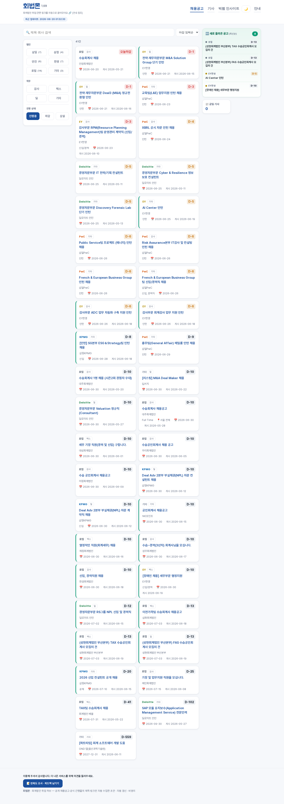

# 신선도 모니터 리포트 — 🚨 신선도 이상(누락 의심)
_2026-06-20 01:33 KST · 데이터 나이 vs 기대 갱신 간격_

| 스트림 | 최근 갱신(generated_at) | 나이 | 기대 간격 | 임계 | 상태 |
|---|---|---:|---:|---:|---|
| 채용공고 | 2026-06-20T01:01:40 | 31분 | 30분 | 1시간 20분 | OK |
| 기사 | 2026-06-20T01:01:44 | 31분 | 2시간 0분 | 4시간 20분 | OK |
| 빅펌 인사이트 | 2026-06-20T01:02:38 | 30분 | 12시간 0분 | 24시간 20분 | OK |
| 푸시 발송 | - | - | 30분 | 1시간 20분 | 🚨 STALE — 파일 없음 |

**소스별 최근 수집 건수**(카나리아 baseline): kicpa_susup 17, kicpa_cpa 42, samjong 3, anjin 20, hanyoung 23, samil 10, filter_leakage 71

## 라이브 사이트 스냅샷 (시각 증거)

---
**자동 생성 알림입니다(Human-in-the-loop).** 데이터가 기대 간격보다 오래 낡았습니다 — 
원인은 대개 **GitHub Actions 스케줄 지연·드롭**입니다. 잦으면 cron 빈도를 더 올리거나 
외부 핑거(`repository_dispatch`)를 고려하세요. 소스 자체 누락은 카나리아를 확인하세요.
